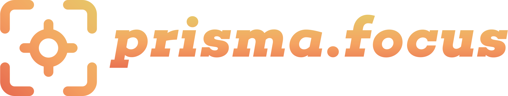
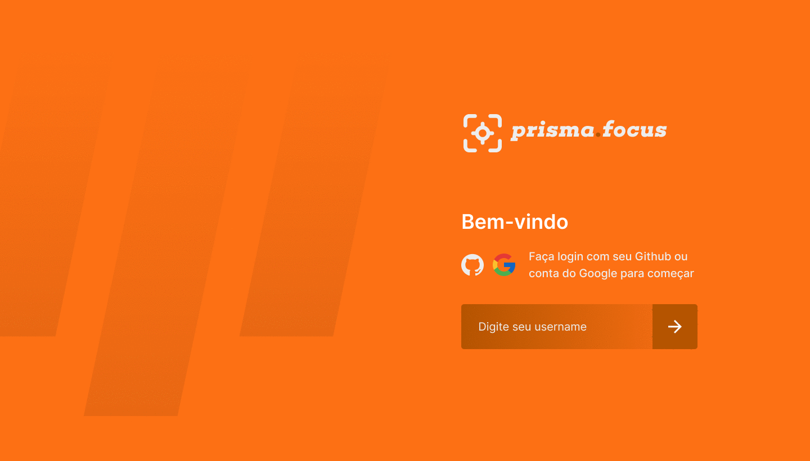

  

<h1 align="center">
  
</h1>

## 💻 Projeto - prisma.focus 2.0

Você pode acessar o projeto clicando neste link [Acessar Projeto](https://prisma-focus-adairjuneo.vercel.app)

O prisma.focus é um app para auxiliar você quando assunto é foco na evolução e cuidados com a saúde. O principal objetivo é ajudar aqueles que passam horas e horas na frente do computador. Estabeleça um tempo de foco e após esse período cumpra desafios para ajudar na sua saúde física e mental.

Este é um projeto desenvolvido como parte da evolução de uma semana de estudos com a **[Rocketseat](https://www.rocketseat.com.br)**.

## 🧪 Tecnologias

Esse projeto foi desenvolvido com as seguintes tecnologias:

- [React](https://reactjs.org)
- [NextJS](https://nextjs.org)
- [TypeScript](https://www.typescriptlang.org/)

## 📚 Bibliotecas

Para auxiliar no desenvolvimento do projeto, utilizei as seguinte bibliotecas:

- [SWR](https://swr.vercel.app)
- [Framer](https://www.framer.com/docs/)
- [Firebase](https://firebase.google.com)
- [ReactToastify](https://fkhadra.github.io/react-toastify/introduction)
- [StyledComponents](https://styled-components.com)

---

Layout desenvolvido por [Tiago Luchtenberg](https://www.instagram.com/tiagoluchtenberg/) by Rocketseat ♥
